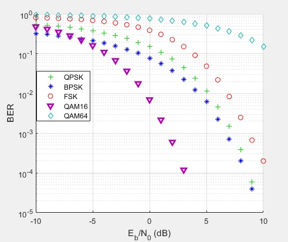

# Digital-Communication-Project
Project using Matlab and Simulink for 3rd year Computer Engineering course Digital Communication (ELC325). The project explores different modulation schemes such as [BPSK](#bpsk), [QPSK](#QPSK), [FSK](#FSK), [QAM16](#QAM16), [QAM64](#QAM64)

[Bonus](#RC): Using Raised Cosine filter

Note: Some plots end shorter than others, meaning there doesn't exist a BER value for certain Eb/No values. This is a reflection of having 0 errors, not a graphing mistake.

## General instructions
Model parameters used:
1. Random Integer Generator
* Initial seed = 37
* Sample time = 0.1s
* Samples per frame = 100
2. AWGN Channel 
* Initial seed = 67
* Input signal power = 1
* Symbol period = 0.1s

Simulation time = 10000s

All scatter plots are taken at the last simulation run. (i.e with db = 10, the highest)

All scatter plots are scaled according to their respective data. (The axes ranges may differ) 

##  1. BPSK Modulation
### Description
BPSK stands for Binary Phase Shift Keying. It's a modulation scheme where the face of the carrier signal is changed depending on the symbol sent. A symbol of value 1 has phase shift = 0, a symbol of value 0 has phase shift = 180.

### Instructions
1. Random Integer Generator

    Set size = 2

2. AWGN Channel

    Number of bits per symbol = 1

All others parameters are the same as above

### Scatter plots
 

### Ber figure
.jpg)

## 2.  QPSK Modulation
### Description
QPSK stands for Quatrature Phase Shift Keying. 

### Instructions
Model parameters used:
1. Random Integer Generator

    Set size = 4

2. AWGN Channel

    Number of bits per symbol = 2

All others parameters are the same as above

### Scatter plots
 

### Ber figure
.jpg)

## 3.  FSK Modulation
### Description
FSK stands for Frequency Shift Keying. It's a modulation scheme where the frequency of the transmitted signals differs for each symbol. 

### Instructions
Model parameters used:
1. Random Integer Generator:

    Set size = 8

2. AWGN Channel

    Number of bits per symbol = 3

All others parameters are the same as above

### Scatter plots
 

### Ber figure
.jpg)

## 4.  QAM16 Modulation
### Description
QAM stands for Quadrature Amplitude Modulation. The basic idea is using 2 carriers, sin and cos, which are 90 phase apart but identical in frequency.
QAM16 means our symbol carries value of 4 bits at once. Each symbol differs from another by changing the amplitude and phase. 

### Instructions
Model parameters used:
1. Random Integer Generator

    Set size = 16

2. Modulator and demodulation

    Normalization method = min. distance

3. AWGN Channel

    Number of bits per symbol = 4

All others parameters are the same as above

### Scatter plots
 

### Ber figure
.jpg)

## 5.  QAM64 Modulation
### Description
Same as QAM16 but supports 8 bits transmission per symbol. Note that this makes QAM64 more error prone as symbols are close on our constellation diagram. 

### Instructions
Model parameters used:
1. Random Integer Generator

    Set size = 64

2. Modulator and demodulation

    Normalization method = min. distance

3. AWGN Channel

    Number of bits per symbol = 6

All others parameters are the same as above

### Scatter plots
 

### Ber figure
.jpg)

## Summary
Here's a plot showing the BER values of all modulation schemes in 1 graph

##  Bonus: Raised Cosine

Parameters:
* Span = 8
* Output symbols = 8
* rolloff = 0.25
* Input processing = Columns as channels (frame based)
* Rate options: Enhance single-rate processing

## 1. BPSK Modulation

All parameters are the same as above

### Scatter plots
 

### Ber figure
.jpg)

## 2. QPSK Modulation

All parameters are the same as above

### Scatter plots
 

### Ber figure
.jpg)

## 3. FSK Modulation
Note: The following FSK results produce an immense error level, which is also unaffected by Eb/No, which doesn't make sense. This is most likely due to some parameter mismatch. I was unable to fix this issue.

These results are obviously wrong

All parameters are the same as above

### Scatter plots
 

### Ber figure
.jpg)

## 4. QAM16 Modulation

All parameters are the same as above

### Scatter plots
 

### Ber figure
.jpg)

## 5. QAM64 Modulation

All parameters are the same as above

### Scatter plots
 

### Ber figure
.jpg)

## Summary
Here's a plot showing the BER values of all modulation schemes after adding the raised cosine

